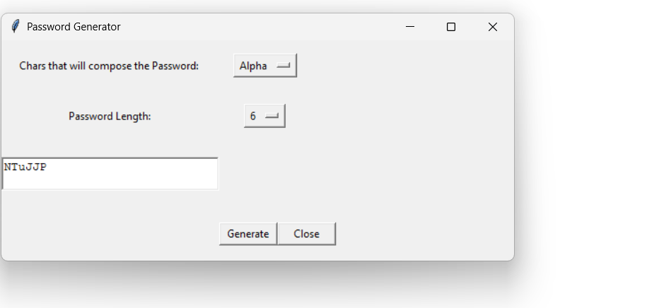
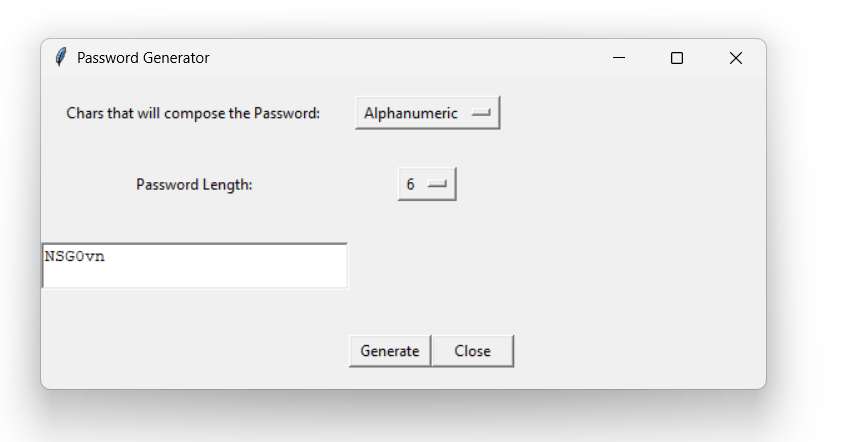

# 🔐 GUI Password Generator

A lightweight Python application that lets you generate secure passwords using a user-friendly graphical interface. Built using the `tkinter` module, this app supports different character sets and customizable password lengths.

---

## 📸 GUI Screenshots

### 🔤 ALPHA Password Mode  


---

### 🔡 ALPHANUMERIC Password Mode  


---

### 🔢 NUMERIC Password Mode  


---

## 🚀 Features

- ✅ Generate strong passwords instantly
- 🔤 Choose between **Alphanumeric**, **Numeric**, or **Alphabetic** character types
- 🔢 Select password length (from 3 to 15 characters)
- 🖥️ Simple and intuitive GUI built using `tkinter`
- 🛑 Exit button to quickly close the app

---

## 🛠 Tech Stack

- **Python 3.x**
- `tkinter` – GUI library
- `random` – For random password generation
- `string` – To access character sets (letters, digits)

---

## 📦 How to Run

1. Clone the repository:
   ```bash
   git clone https://github.com/Shubham-Loshali/GUI-Password-Generator.git
   cd GUI-Password-Generator
